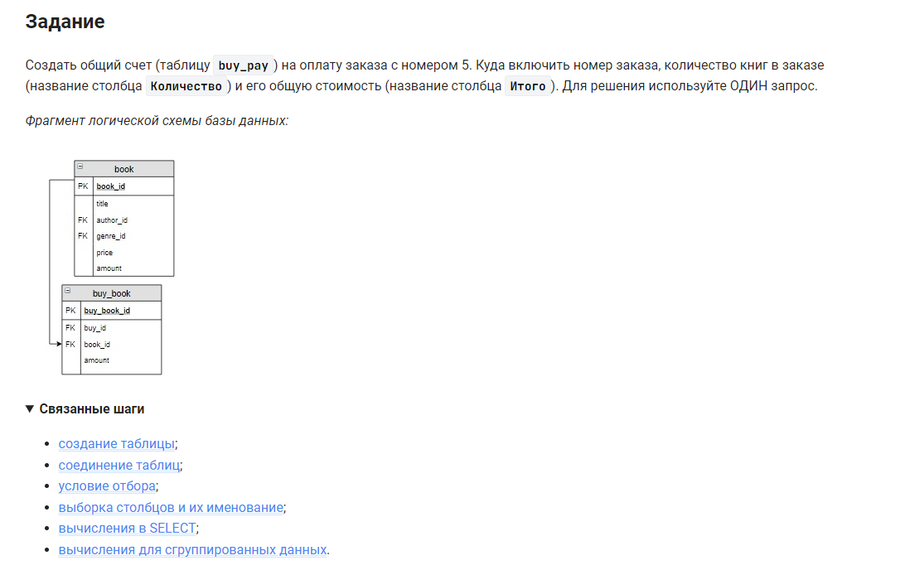

```sql 
CREATE TABLE buy_pay AS                         /* создать таблицу как */
    SELECT                                      /* выбрать данные */
        buy_id,                                 /* столбец */
        SUM(buy_book.amount) AS Количество,     /* столбец */
        SUM(price * buy_book.amount) AS Итого   /* столбец */
FROM book                                       /* из таблицы */
    JOIN buy_book USING(book_id)                /* объединенную с таблице (по столбцу) */
WHERE buy_book.buy_id = 5;                      /* где условие */
```


#### На [главную](https://github.com/BEPb/stepik_sql#readme)

---


