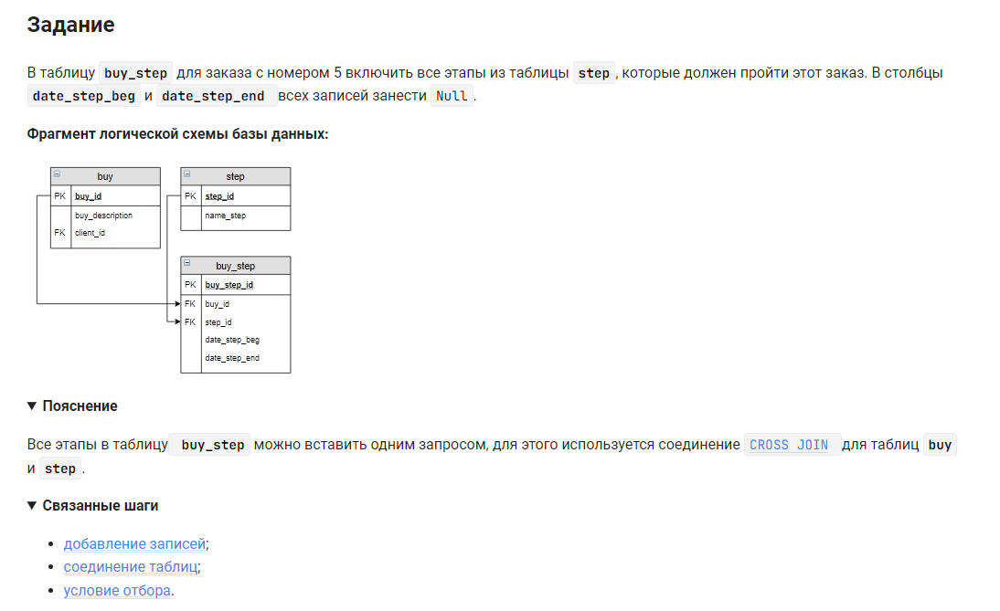

```sql 
INSERT INTO buy_step (buy_id, step_id)  /* вставить в таблицу (столбцы) */
SELECT buy_id,                          /* столбец */
       step_id                          /* столбец */
FROM buy CROSS JOIN step                /* из таблицы объединенной с таблицей */
WHERE buy_id = 5;                       /* где условие */
```
упростим:
```sql
INSERT INTO buy_step (buy_id, step_id)  /* вставить в таблицу (столбцы) */
SELECT 5, step_id                       /* столбцы */
FROM step                               /* из таблицы */
```

#### На [главную](https://github.com/BEPb/stepik_sql#readme)

---


