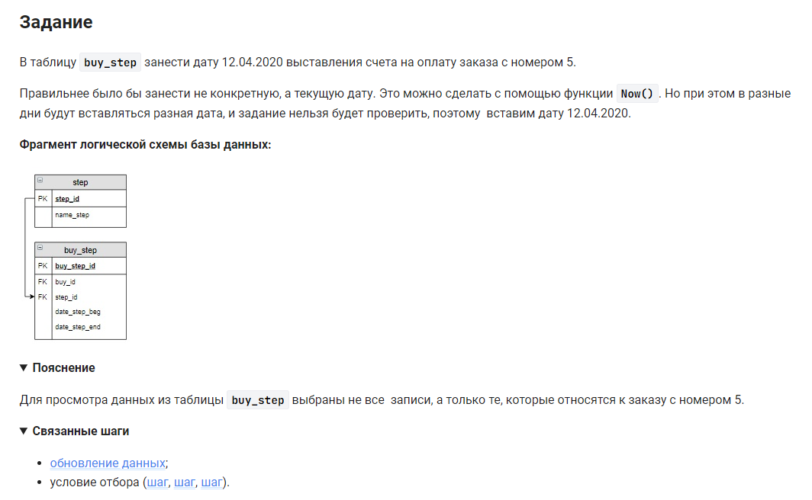

```sql 
UPDATE                                      /* обновить */
    buy_step                                /* таблицу */
    JOIN step USING (step_id)               /* объединенную с таблицей */
SET                                         /* внести данные */
    buy_step.date_step_beg = '2020-04-12'   /* в столбец значения */
WHERE                                       /* где */
    buy_step.buy_id = 5 &&                  /* условие 1 */
    step.name_step = 'Оплата';              /* условие 2 */
```


#### На [главную](https://github.com/BEPb/stepik_sql#readme)

---


