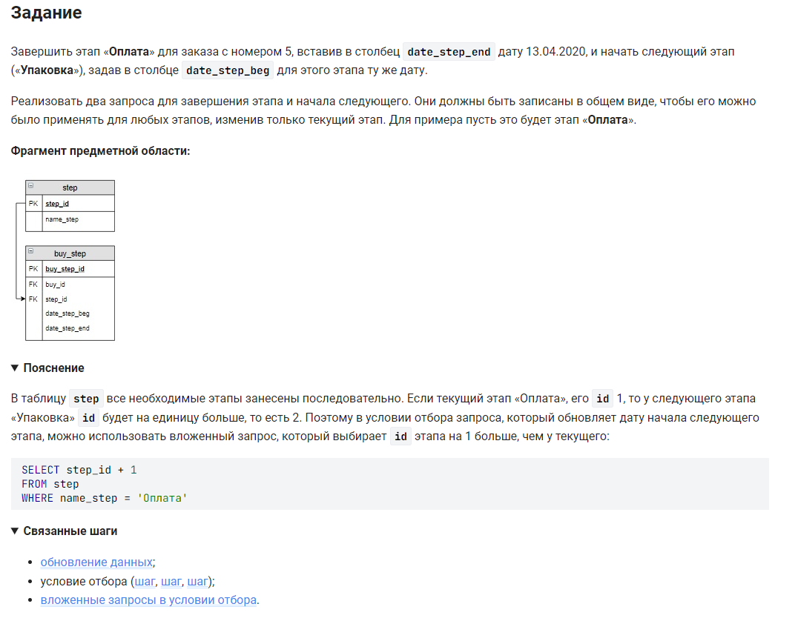

```sql 
-- первый запрос
UPDATE                              /* обновить */
    buy_step bs                     /* таблицу */
    JOIN step USING (step_id)       /* объединенную с таблицей по столбцу */
SET                                 /* внести значения */
    bs.date_step_end = "2020-04-13" /* в столбец = */
WHERE                               /* где */
    bs.buy_id = 5 AND               /* условие 1 */
    step.name_step = "Оплата";      /* условие 2 */
-- второй запрос
UPDATE                              /* обновить */
    buy_step bs                     /* таблицу */
    JOIN step USING (step_id)       /* объединенную с таблицей по столбцу */
SET                                 /* внести значения */
    bs.date_step_beg = "2020-04-13" /* в столбец = */
WHERE                               /* где */
    bs.buy_id = 5 AND               /* условие 1 */
    step.name_step = "Упаковка";    /* условие 2 */
```


#### На [главную](https://github.com/BEPb/stepik_sql#readme)

---


