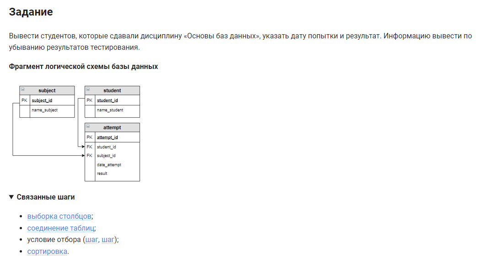

```sql
SELECT                                      /* выбрать данные */
    name_student, date_attempt, result      /* столбцы */
FROM student                                /* из таблицы */
    INNER JOIN attempt USING (student_id)   /* объединенной с таблицей по столбцу */
    INNER JOIN subject USING (subject_id)   /* объединенной с таблицей по столбцу */
WHERE                                       /* где */
    name_subject = "Основы баз данных"      /* условие */
ORDER BY                                    /* отсортировать */
    result DESC;                            /* по убыванию результата */
```
или:

```sql 
SELECT                                      /* выбрать данные */
    name_student, date_attempt, result      /* столбцы */
FROM student                                /* из таблицы */
    JOIN attempt USING (student_id)         /* объединенной с таблицей по столбцу */
    JOIN subject USING (subject_id)         /* объединенной с таблицей по столбцу */ 
WHERE                                       /* где */
    name_subject = "Основы баз данных"      /* условие */
ORDER BY                                    /* отсортировать */
    result DESC;                            /* по убыванию результата */
```


#### На [главную](https://github.com/BEPb/stepik_sql#readme)

---


