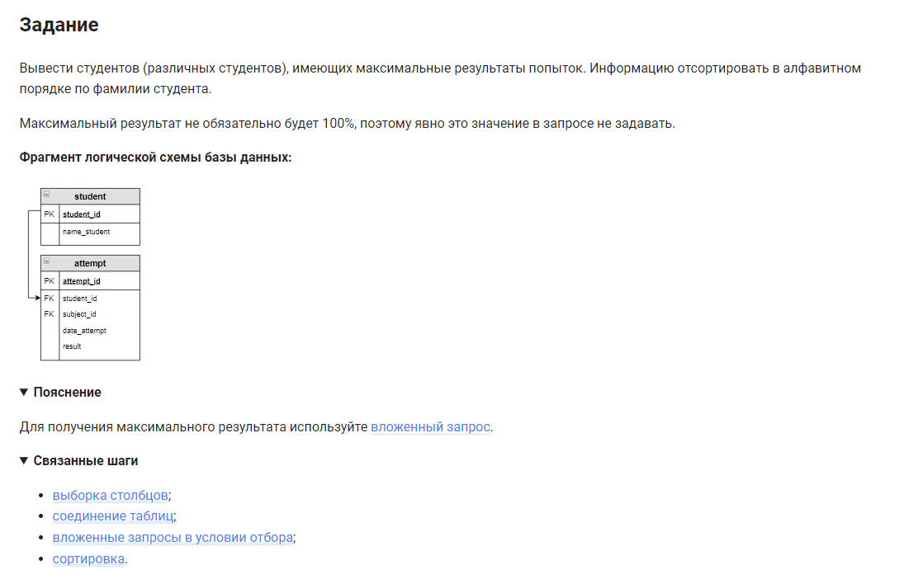

```sql 
SELECT name_student, result                 /* выбрать данные из столбцов */
FROM student                                /* из таблицы */
    INNER JOIN attempt USING (student_id)   /* объединенной с таблицей по столбцу */
WHERE result =                              /* где столбец результат = вложенный запрос */
    (SELECT MAX(result) FROM attempt)       /* максимальному результату из таблицы */
ORDER BY name_student;                      /* отсортировать по фамилии студентов */
```


#### На [главную](https://github.com/BEPb/stepik_sql#readme)

---


