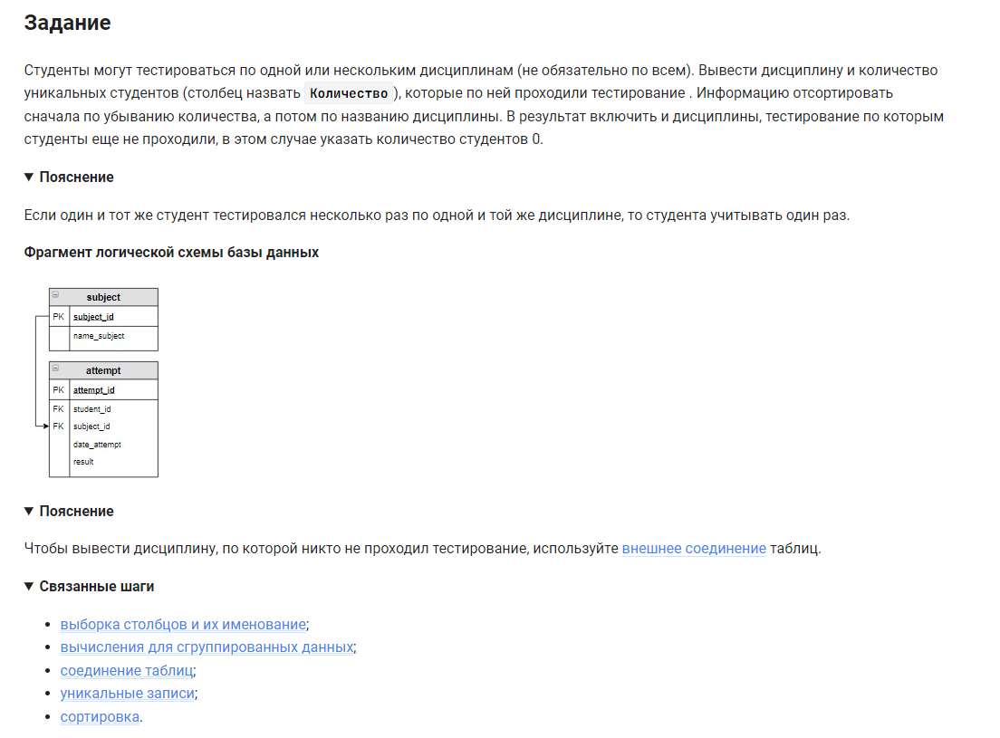

```sql 
SELECT                                          /* выбрать данные */
    name_subject,                               /* столбец */
    COUNT(DISTINCT student_id) AS Количество    /* столбец количество */
FROM subject                                    /* из таблицы */
    LEFT JOIN attempt USING (subject_id)        /* объединенной с таблицей по столбцу */
GROUP BY name_subject                           /* сгруппировать по столбцу */
ORDER BY Количество DESC, name_subject;         /* отсортировать по количеству */
```


#### На [главную](https://github.com/BEPb/stepik_sql#readme)

---


