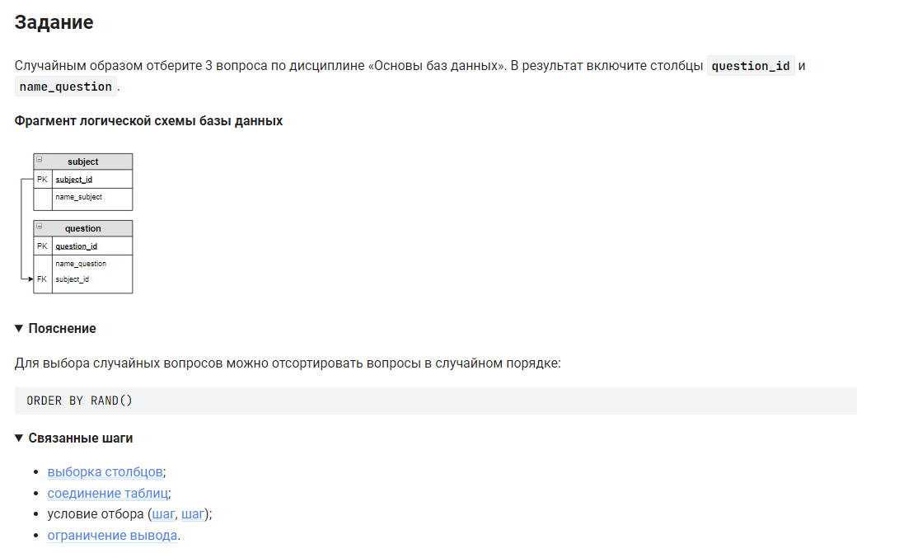

```sql 
SELECT                                          /* выбрать данные */
    question_id,                                /* столбец */
    name_question                               /* столбец */
FROM                                            /* из */
    question                                    /* таблицы */
    JOIN subject USING (subject_id)             /* объединенной с таблицей по столбцу */
WHERE                                           /* где */
    subject.name_subject = "Основы баз данных"  /* условие */
ORDER BY RAND()                                 /* отсортировать в случайном порядке */
LIMIT 3;                                        /* выбрать 3 значения */
```


#### На [главную](https://github.com/BEPb/stepik_sql#readme)

---


