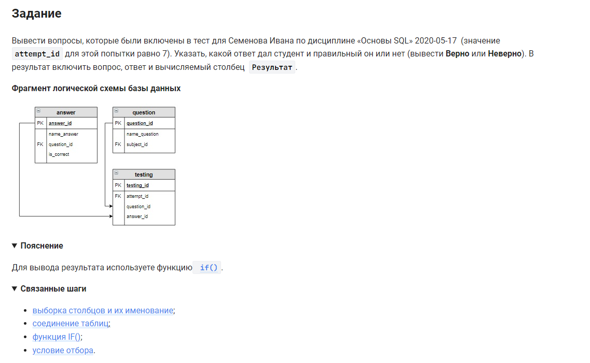

```sql 
SELECT                                                              /* выбрать данные */
    name_question,                                                  /* столбец */
    name_answer,                                                    /* столбец */
    IF(is_correct = 1, "Верно", "Неверно") AS Результат             /* столбец */
FROM answer                                                         /* из таблицы */
    INNER JOIN testing USING (answer_id)                            /* объединенной с таблицей */
    INNER JOIN question ON testing.question_id = question.question_id   /* объединенной с таблицей */
WHERE attempt_id = 7;                                               /* где значение =7 */
```


#### На [главную](https://github.com/BEPb/stepik_sql#readme)

---


