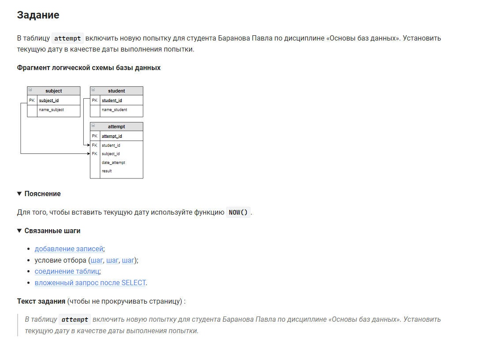

```sql
INSERT INTO                                                 /* вставить в */
    attempt (student_id, subject_id, date_attempt, result)  /* таблицу (столбцы) */
VALUES (                                                    /* значения */
    (SELECT student_id FROM student WHERE name_student = "Баранов Павел"),     /* значение */ 
    (SELECT subject_id FROM subject WHERE name_subject = "Основы баз данных"), /* значение */
    NOW(),                                                                      /* значение */ 
    NULL                                                                        /* значение */
);
```


#### На [главную](https://github.com/BEPb/stepik_sql#readme)

---


