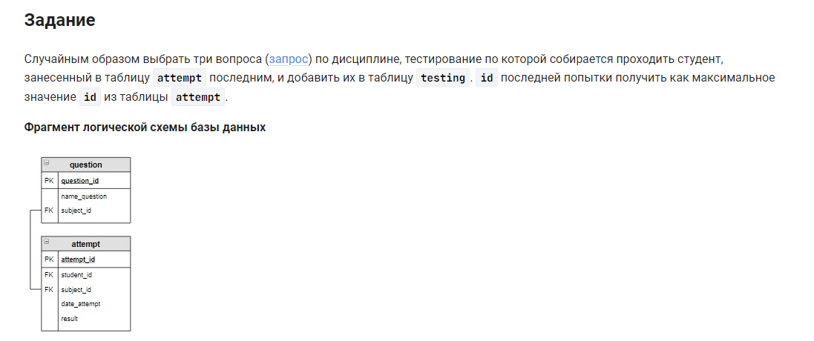

```sql
INSERT INTO                                 /* вставить в */
    testing (attempt_id, question_id)       /* таблицу (столбцы) */
SELECT                                      /* выбрать данные */
    att.attempt_id,                         /* столбец */
    qst.question_id                         /* столбец */
FROM                                        /* из */
    question qst                            /* таблицы */
    JOIN attempt att USING (subject_id)     /* объединенной с таблицей (по столбцу) */
WHERE                                       /* где */
    att.attempt_id =                        /* условие = встроенному запросу */
    (SELECT MAX(attempt_id) FROM attempt)   /* встроенный запрос максимальное значение столбца из таблицы */
ORDER BY RAND()                             /* выбрать случайные значения */
LIMIT 3;                                    /* не более 3-х строк */
```


#### На [главную](https://github.com/BEPb/stepik_sql#readme)

---


