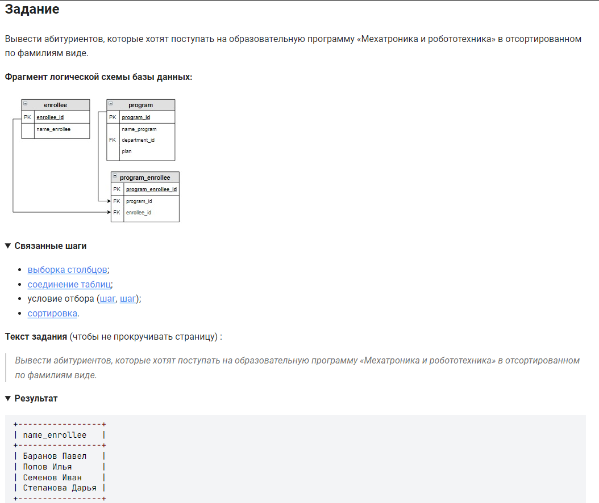

```sql
SELECT name_enrollee                                /* выбрать данные и столбца */
FROM program                                        /* таблицы */
    INNER JOIN program_enrollee USING (program_id)  /* объединенной с таблицей по (столбцу) */
    INNER JOIN enrollee USING (enrollee_id)         /* объединенной с таблицей по (столбцу) */
WHERE name_program = "Мехатроника и робототехника"  /* где условие */
ORDER BY name_enrollee;                             /* отсортировать по столбцу */
```


#### На [главную](https://github.com/BEPb/stepik_sql#readme)

---


