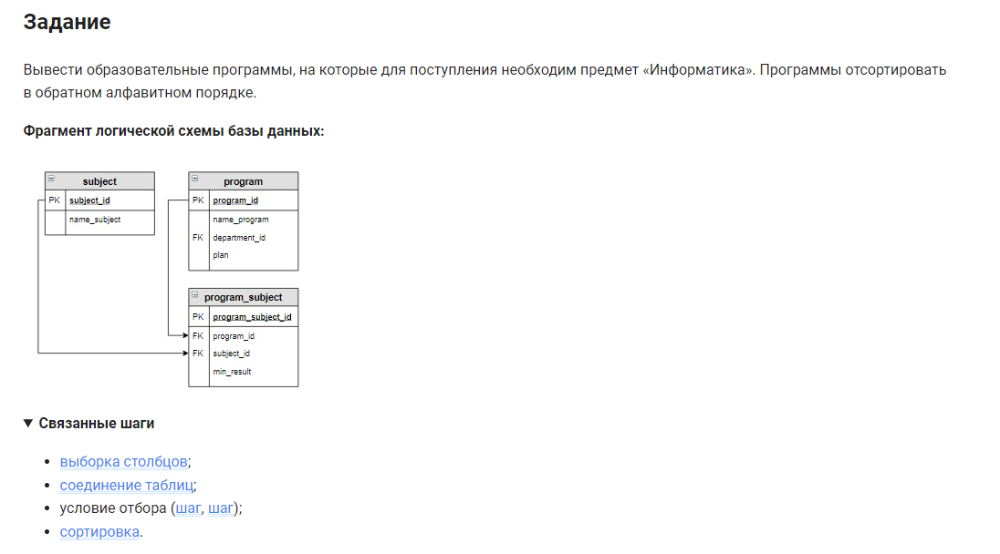

```sql
SELECT name_program                                 /* выбрать данные столбца */
FROM program                                        /* из таблицы */
    INNER JOIN program_subject USING (program_id)   /* объединенной с таблицей по столбцу */
    INNER JOIN subject USING (subject_id)           /* объединенной с таблицей по столбцу */
WHERE name_subject = "Информатика";                 /* где условие */
```


#### На [главную](https://github.com/BEPb/stepik_sql#readme)

---


