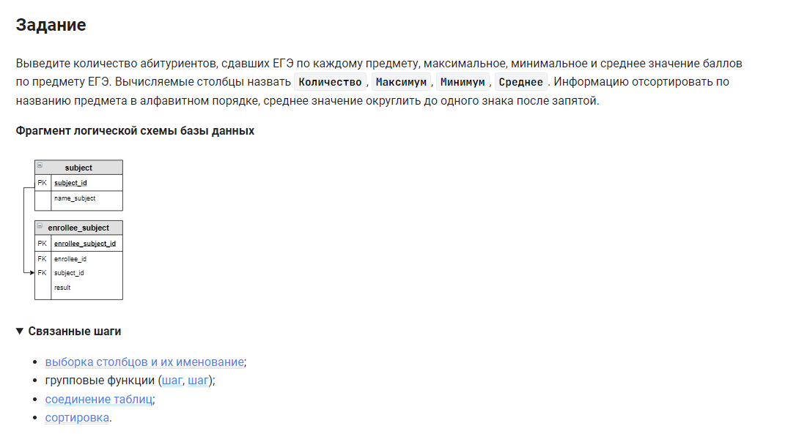

```sql
SELECT                                              /* выбрать данные */
    ANY_VALUE(name_subject) AS name_subject,        /* столбец */
    COUNT(name_subject) AS Количество,              /* столбец */
    MAX(result) AS Максимум,                        /* столбец */
    MIN(result) AS Минимум,                         /* столбец */
    ROUND(AVG(result), 1) AS Среднее                /* столбец */
FROM subject                                        /* из таблицы */
    INNER JOIN enrollee_subject USING (subject_id)  /* объединенной с таблицей по столбцу */
GROUP BY subject_id                                 /* сгруппировать по столбцу */
ORDER BY name_subject;                              /* вывести результат по столбцу */
```


#### На [главную](https://github.com/BEPb/stepik_sql#readme)

---


