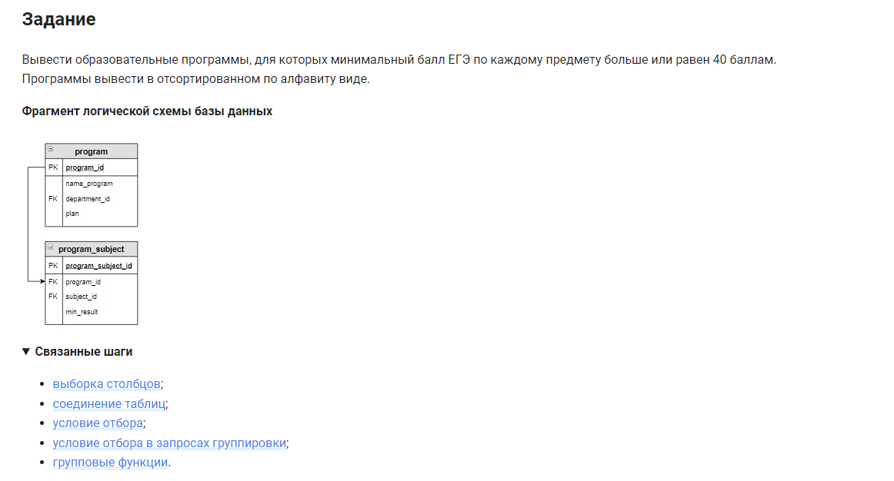

```sql
SELECT DISTINCT                                     /* выбрать уникальные значения */
    ANY_VALUE(name_program) AS name_program         /* столбца */
FROM program                                        /* из таблицы */
    INNER JOIN program_subject USING (program_id)   /* объединенной с таблицей по столбцу */
GROUP BY name_program                               /* сгруппировать по столбцу */
HAVING MIN(min_result) >= 40                        /* условие */
ORDER BY name_program;                              /* отсортировать по столбцу */
```


#### На [главную](https://github.com/BEPb/stepik_sql#readme)

---


