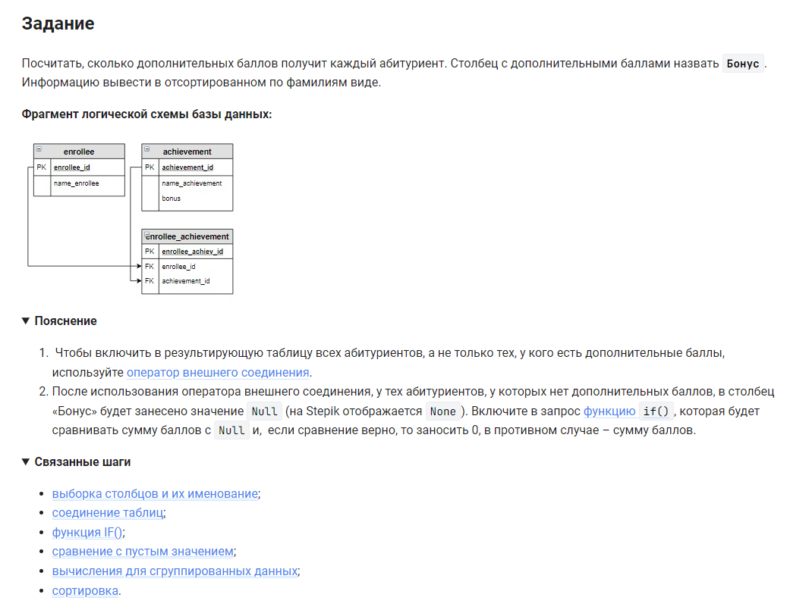

```sql
SELECT                                                      /* выбрать данные */
    name_enrollee,                                          /* столбец */
    IF(SUM(bonus) IS NULL, 0, SUM(bonus)) AS Бонус          /* столбец */
FROM achievement                                            /* из таблицы */
    INNER JOIN enrollee_achievement USING (achievement_id)  /* объединенной с таблицей по столбцу */
    RIGHT JOIN enrollee USING (enrollee_id)                 /* объединенной с таблицей по столбцу */
GROUP BY enrollee_id                                        /* сгруппировать по столбцу */
ORDER BY name_enrollee;                                     /* отсортировать по столбцу */
```


#### На [главную](https://github.com/BEPb/stepik_sql#readme)

---


