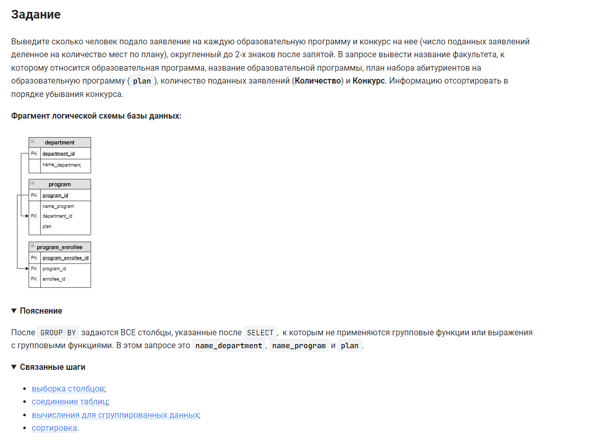

```sql
SELECT                                              /* выбрать данные */
    name_department,                                /* столбец */
    name_program,                                   /* столбец */
    plan,                                           /* столбец */
    COUNT(enrollee_id) AS Количество,               /* столбец */
    ROUND(COUNT(enrollee_id) / plan, 2) AS Конкурс  /* столбец */
FROM department                                     /* из таблицы */
    INNER JOIN program USING (department_id)        /* объединенной с таблицей по столбцу */
    INNER JOIN program_enrollee USING (program_id)  /* объединенной с таблицей по столбцу */
GROUP BY name_department, name_program, plan        /* сгруппировать по столбцам */
ORDER BY Конкурс DESC;                              /* отсортировать по столбцу в обратном порядке */
```


#### На [главную](https://github.com/BEPb/stepik_sql#readme)

---


