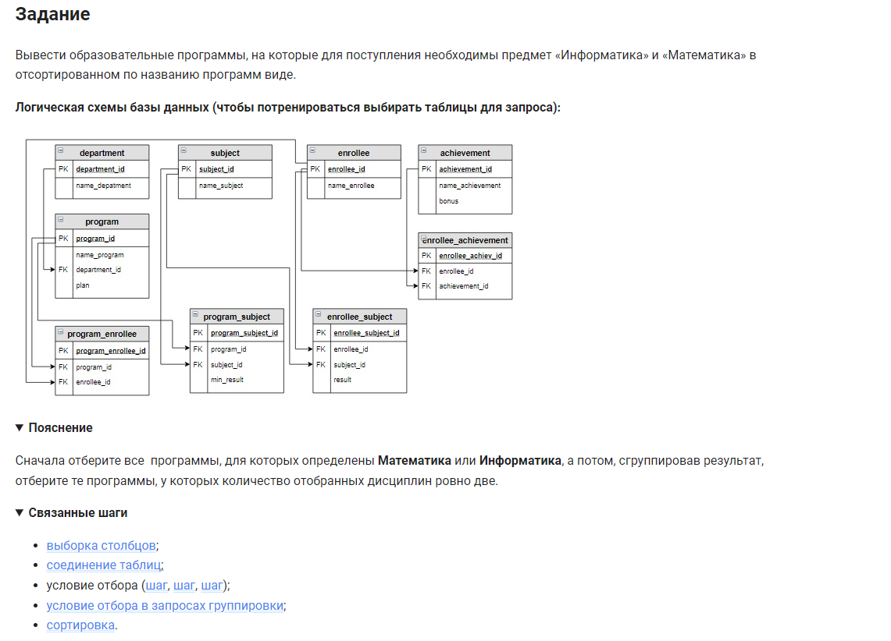

```sql
SELECT ANY_VALUE(name_program) AS name_program      /* выбрать данные столбец */
FROM program                                        /* из таблицы */
    INNER JOIN program_subject USING (program_id)   /* объединенная с таблицей по столбцу */
    INNER JOIN subject USING (subject_id)           /* объединенная с таблицей по столбцу */
WHERE name_subject IN ("Информатика", "Математика") /* где условие */
GROUP BY name_program                               /* сгруппировать по столбцу */
HAVING COUNT(name_subject) = 2                      /* условие 2 */
ORDER BY name_program;                              /* отсортировать по столбцу */
```


#### На [главную](https://github.com/BEPb/stepik_sql#readme)

---


