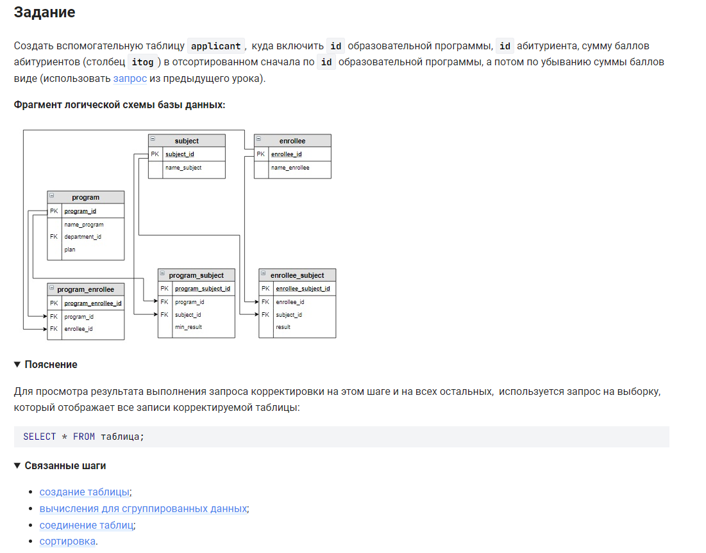

```sql
CREATE TABLE applicant                                      /* создать таблицу */
SELECT                                                      /* выбрать данные */
    program_id,                                             /* столбец */
    enrollee.enrollee_id,                                   /* столбец */
    SUM(result) AS itog                                     /* столбец */
FROM enrollee                                               /* из таблицы */
     JOIN program_enrollee USING(enrollee_id)               /* объединенной с таблицей по столбцу */
     JOIN program USING(program_id)                         /* объединенной с таблицей по столбцу */
     JOIN program_subject USING(program_id)                 /* объединенной с таблицей по столбцу */
     JOIN subject USING(subject_id)                         /* объединенной с таблицей по столбцу */
     JOIN enrollee_subject USING(subject_id)                /* объединенной с таблицей по столбцу */
WHERE enrollee_subject.enrollee_id = enrollee.enrollee_id   /* где условие */
GROUP BY program_id, enrollee_id                            /* сгруппировать по столбцам */
ORDER BY program_id, itog DESC;                             /* отсортировать по столбцам */
```


#### На [главную](https://github.com/BEPb/stepik_sql#readme)

---


