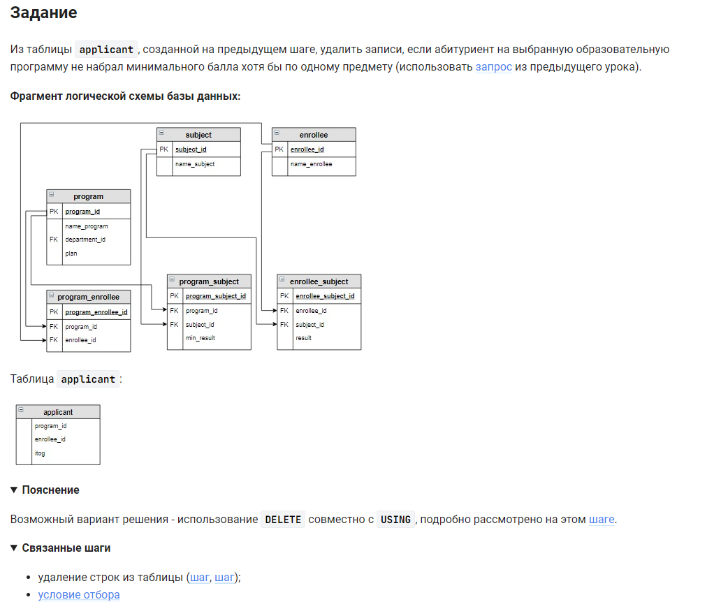

```sql
DELETE applicant                                        /* удалить столбец */
FROM applicant                                          /* таблицы */
    JOIN program_subject USING(program_id)              /* объединенной с таблицей по (столбцу) */
    JOIN enrollee_subject USING(enrollee_id, subject_id) /* объединенной с таблицей по (столбцам) */
WHERE result < min_result;                              /* где условие */
```


#### На [главную](https://github.com/BEPb/stepik_sql#readme)

---


