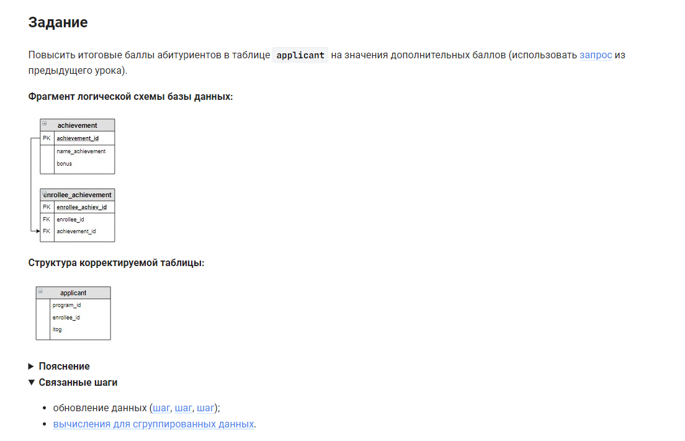

```sql
UPDATE applicant                /* обновить таблицу */
    -- объединение
    JOIN
        -- началов встроенного запроса
        (SELECT                                                         /* выбрать данные */
            enrollee_id,                                                /* столбец */
            IF(SUM(bonus) IS NULL, 0, SUM(bonus)) AS Бонус              /* столбец */
            FROM achievement                                            /* из таблицы */
                INNER JOIN enrollee_achievement USING (achievement_id)  /* объединенной с таблицей по (столбцу) */
                RIGHT JOIN enrollee USING (enrollee_id)                 /* объединенной с таблицей по (столбцу) */
            GROUP BY enrollee_id                                        /* сгруппировать по столбцу */
            ORDER BY enrollee_id) AS buff                               /* отсортировать по столбцу, результат поместить в буфер */
        -- конец встроенного запроса
    USING (enrollee_id)                                                 /* объединенной с таблицей по (столбцу) */
SET itog = itog + buff.Бонус;                                           /* пересчитать значения столбца */
```


#### На [главную](https://github.com/BEPb/stepik_sql#readme)

---


