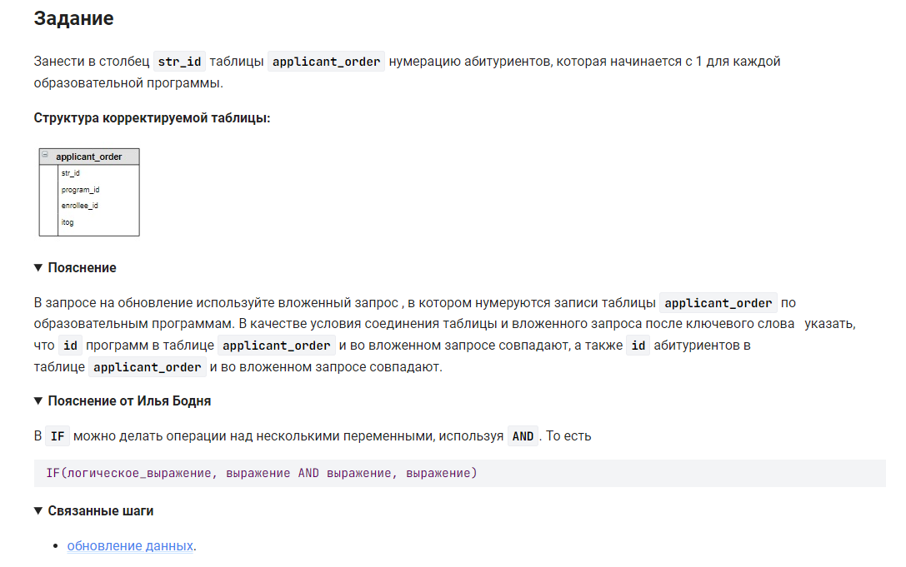

```sql
-- задаем переменные
SET @num_pr := 1;
SET @row_num := 0;

-- создаем запрос
UPDATE applicant_order  /* обновить таблицу */
    SET str_id = if(program_id = @num_pr,                       /* если условие 1 истина */
                    @row_num := @row_num + 1,                   /* то заменить на значение */
                    @row_num := 1 AND @num_pr := @num_pr + 1);  /* иначе заменить на */
```


#### На [главную](https://github.com/BEPb/stepik_sql#readme)

---


