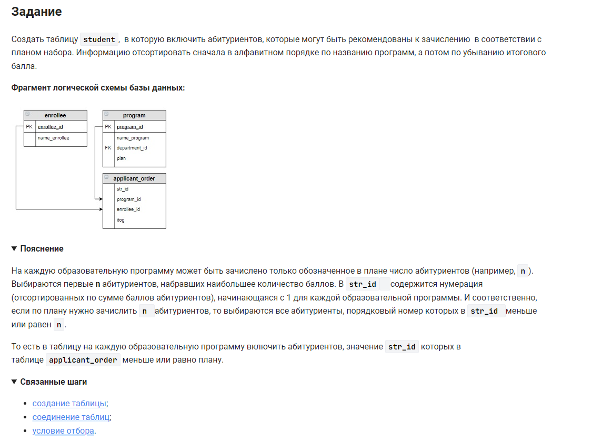

```sql
CREATE TABLE student AS                             /* создать таблицу как */
SELECT                                              /* выбрать данные */
    name_program,                                   /* столбец */
    name_enrollee,                                  /* столбец */
    itog                                            /* столбец */
FROM program                                        /* из таблицы */
    INNER JOIN applicant_order USING (program_id)   /* объединенной с таблицей по (столбцу) */
    INNER JOIN enrollee USING (enrollee_id)         /* объединенной с таблицей по (столбцу) */
WHERE str_id <= plan                                /* где условие */
ORDER BY name_program, itog DESC;                   /* отсортировать по столбцам */
```


#### На [главную](https://github.com/BEPb/stepik_sql#readme)

---


