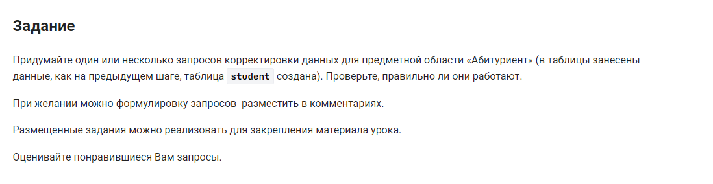

```sql
-- первый запрос
DELETE FROM student                /* удалить из таблицы */
USING student                      /* используюя таблицу */
WHERE name_program LIKE '%мат%';   /* где название содержит символы */
-- второй запрос
SELECT * FROM student;             /* вывести таблицу */
```


#### На [главную](https://github.com/BEPb/stepik_sql#readme)

---


