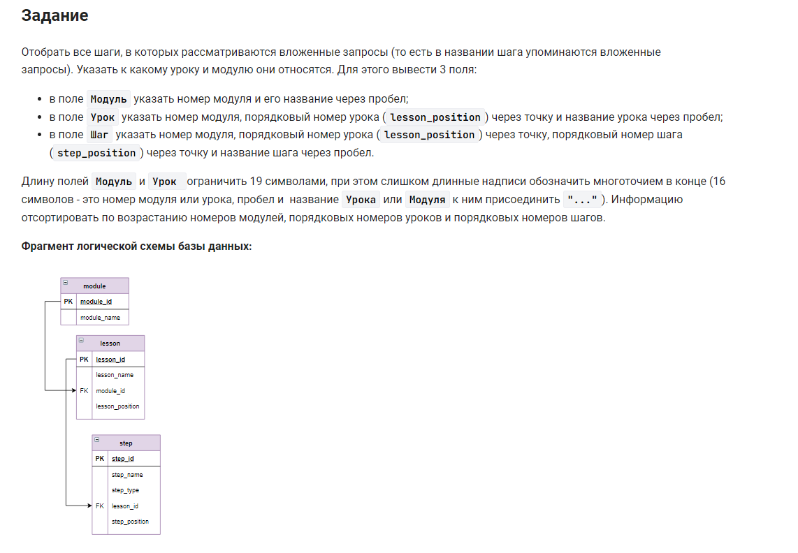

```sql
SELECT          /* выбрать данные */
    -- собираем значение первого столбца
    -- 16 символов - это номер модуля, пробел и  название Модуля,к ним присоединить "..."
    CONCAT(LEFT(CONCAT(CONCAT(module_id, " "), module_name), 16), "...") AS Модуль,
    -- собираем значение второго столбца
    -- 16 символов - порядковый номер урока (lesson_position) через точку и название урока через пробел, к ним присоединить "..."
    CONCAT(LEFT(CONCAT(CONCAT(CONCAT(module_id, "."), CONCAT(lesson_position, " ")), lesson_name), 16), "...") AS Урок,
    -- собираем значение третьего столбца
    -- номер модуля, порядковый номер урока (lesson_position) через точку, порядковый номер шага (step_position) через точку и название шага через пробел
    CONCAT(CONCAT(CONCAT(CONCAT(module_id, "."), CONCAT(lesson_position, ".")), CONCAT(step_position, " ")), step_name) AS Шаг
FROM module                             /* из модуля */
    INNER JOIN lesson USING (module_id) /* объединить с таблицей по (столбцу) */    
    INNER JOIN step USING (lesson_id)   /* объединить с таблицей по (столбцу) */
WHERE step_name LIKE "%вложен%запрос%"  /* где условие */
ORDER BY module_id, lesson_id, step_id; /* отсортировать по столбцам */
```


#### На [главную](https://github.com/BEPb/stepik_sql#readme)

---


