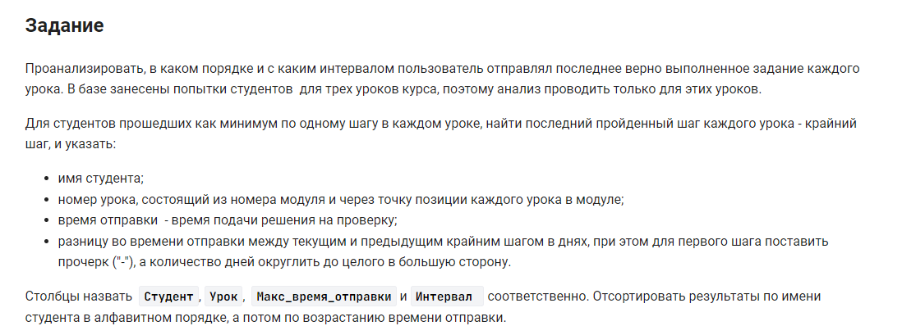

```sql
WITH get_time_lesson(student_name,  lesson, max_submission_time)
AS(
    SELECT student_name,  CONCAT(module_id, '.', lesson_position), MAX(submission_time)
    FROM step_student INNER JOIN step USING (step_id)
                          INNER JOIN lesson USING (lesson_id)
                          INNER JOIN student USING(student_id)
    WHERE  result = 'correct'  
    GROUP BY 1,2
    ORDER BY 1),
get_students(student_name)
AS(
    SELECT student_name 
    FROM get_time_lesson
    GROUP BY student_name
    HAVING COUNT(lesson) = 3)
SELECT student_name as Студент,  
       lesson as Урок, 
       FROM_UNIXTIME(max_submission_time) as Макс_время_отправки, 
       IFNULL(CEIL((max_submission_time - LAG(max_submission_time) OVER (PARTITION BY student_name ORDER BY max_submission_time )) / 86400),'-') as Интервал 
FROM get_time_lesson
WHERE student_name in (SELECT * FROM get_students)
ORDER BY 1,3;
```


#### На [главную](https://github.com/BEPb/stepik_sql#readme)

---


