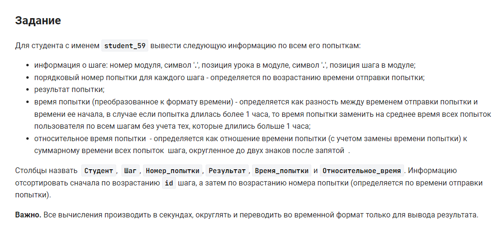

```sql
SET @avg_time := (SELECT CEIL(AVG(submission_time - attempt_time))
FROM step_student INNER JOIN student USING(student_id)
WHERE student_name = "student_59" AND (submission_time - attempt_time) < 3600);
WITH get_stat
AS
(
SELECT student_name, CONCAT(module_id, ".", lesson_position, ".", step_position) AS less, step_id, RANK() OVER (PARTITION BY CONCAT(module_id, ".", lesson_position, ".", step_position) ORDER BY submission_time) AS rang, result, 
CASE
    WHEN (submission_time - attempt_time) > 3600 THEN @avg_time
    ELSE (submission_time - attempt_time)
END AS qr
FROM student 
    INNER JOIN step_student USING(student_id)
    INNER JOIN step USING(step_id)
    INNER JOIN lesson USING(lesson_id)
WHERE student_name = "student_59"
)
SELECT student_name AS Студент, less AS Шаг, rang AS Номер_попытки, result AS Результат, SEC_TO_TIME(CEIL(qr)) AS Время_попытки, ROUND((qr / (SUM(qr) OVER (PARTITION BY less ORDER BY less)) * 100), 2) AS Относительное_время
FROM get_stat
ORDER BY step_id, 3;
```


#### На [главную](https://github.com/BEPb/stepik_sql#readme)

---


