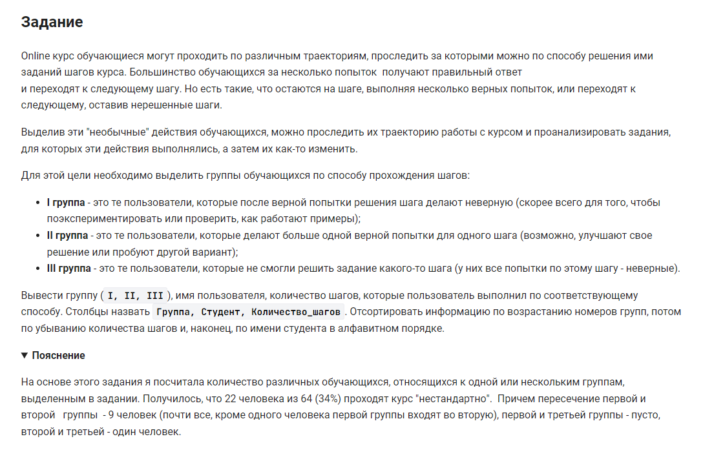

```sql
WITH
table1 AS -- Добавлен ЛАГ
    (SELECT student_name, result, 
            LAG(result) OVER (PARTITION BY student_id, step_id 
                              ORDER BY  student_id, step_id, submission_time) AS lag_result 
     FROM step_student JOIN student USING (student_id)
    ),
table12 AS -- Отбор по условию lag_result = 'correct' AND result = 'wrong' (Группа 1)
    (SELECT 'I' AS Группа, student_name AS Студент, COUNT(*) AS Количество_шагов
     FROM table1
     WHERE lag_result = 'correct' AND result = 'wrong'
     GROUP BY student_name
     ORDER BY 3 DESC, 2
     ),
table2 AS -- Только верно решенные шаги
     (SELECT student_name, CONCAT (student_id, '.', step_id) AS student_step
      FROM step_student JOIN student USING (student_id)
      WHERE result = 'correct'
     ),
table22 AS -- Верно решенные несколько раз шаги
     (SELECT student_name, student_step, COUNT(student_step) AS Количество_верных
      FROM table2
      GROUP BY 2, 1
      HAVING COUNT(student_step) > 1
      ORDER BY 2
     ),
table23 AS -- Подсчет верно решенных шагов у студентов (Группа 2)
     (SELECT 'II' AS Группа, student_name AS Студент, COUNT(student_name) AS Количество_шагов
      FROM table22
      GROUP BY 2, 1
      ORDER BY 3 DESC, 2
     ),
table3 AS -- Все student_step c ошибками
    (SELECT DISTINCT CONCAT (student_id, '.', step_id) AS student_step
     FROM step_student JOIN student USING (student_id)
     WHERE result = 'wrong'
    ),
table31 AS
    (SELECT student_name, result, CONCAT (student_id, '.', step_id) AS student_step
     FROM step_student JOIN student USING (student_id)
    ),
table32 AS -- Все student_step c одним вариантом result (или только correct или только wrong)
    (SELECT student_step, student_name
     FROM table31
     GROUP BY student_step, student_name
     HAVING COUNT(DISTINCT result) = 1
    ),
table33 AS -- группа 3
    (SELECT 'III' AS Группа, student_name AS Студент, COUNT(student_name) AS Количество_шагов
     FROM table3 INNER JOIN table32 USING(student_step)
     GROUP BY 2, 1
     ORDER BY 3 DESC, 2
     )
SELECT * FROM table12 UNION ALL SELECT * FROM table23 UNION ALL SELECT * FROM table33;
```


#### На [главную](https://github.com/BEPb/stepik_sql#readme)

---


