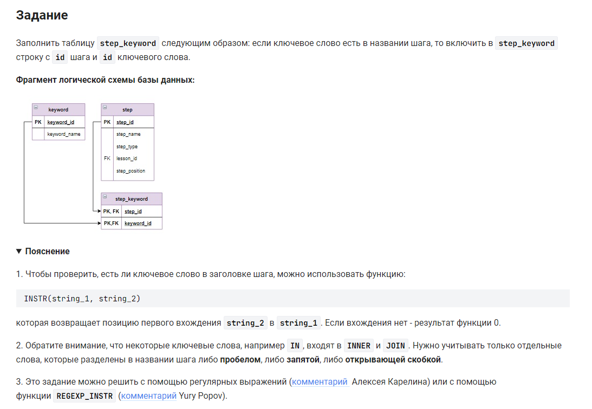

```sql
INSERT INTO step_keyword (step_id, keyword_id)              /* вставить в таблицу (столбцы) */
        SELECT step_id, keyword_id                          /* выбрать данные столбцов */
        FROM step                                           /* из таблицы */
        CROSS JOIN keyword                                  /* объединенной с таблицей */
    WHERE step.step_name REGEXP                             /* условие 1 */
        (CONCAT('\\b', keyword.keyword_name, '\\b'));       /* создаем строку */
```


#### На [главную](https://github.com/BEPb/stepik_sql#readme)

---


