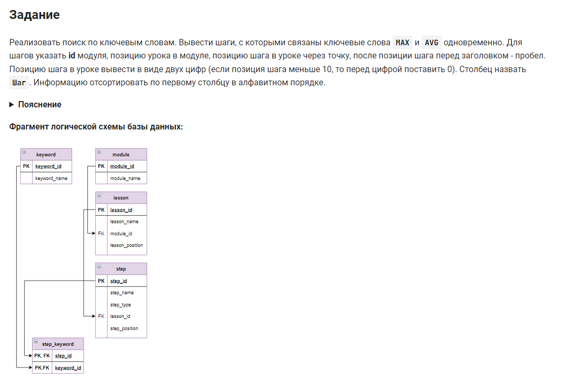

```sql
SELECT                                      /* выбрать данные */
    -- создаем столбец указать номер модуля, номер урока, номер шага через точку, 
    -- после номера шага перед заголовком - пробел. Столбец назвать Шаг.
    concat(module_id,'.',lesson_position,   
           IF(step_position < 10, ".0","."),
           step_position," ",step_name) AS Шаг
FROM step                                   /* из таблицы */
   JOIN lesson USING(lesson_id)             /* объединенной с таблицей по (столбцу) */
   JOIN module USING(module_id)             /* объединенной с таблицей по (столбцу) */
   JOIN step_keyword USING (step_id)        /* объединенной с таблицей по (столбцу) */
   JOIN keyword USING(keyword_id)           /* объединенной с таблицей по (столбцу) */
WHERE keyword_name = 'MAX' OR keyword_name ='AVG' /* где условие 1 или условие 2 */
GROUP BY ШАГ                                /* сгруппировать по столбцу */
HAVING COUNT(*) = 2                         /* условие количество = 2 */
ORDER BY 1;                                 /* отсортировать по 1-му столбцу */
```


#### На [главную](https://github.com/BEPb/stepik_sql#readme)

---


