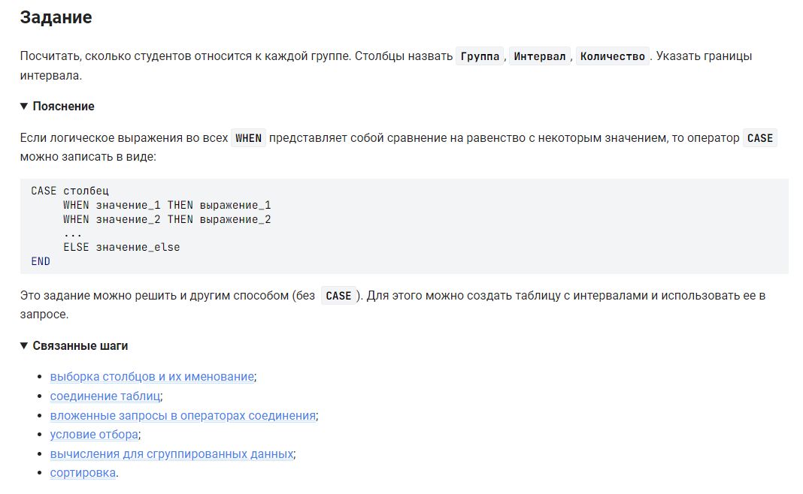

```sql
SELECT Группа,                                  /* выбрать данные столбца */
    CASE                                        /* столбец, где начало условий */
        WHEN Группа = "I" THEN "от 0 до 10"     /* условие 1 - результат */
        WHEN Группа = "II" THEN "от 11 до 15"   /* условие 2 - результат */
        WHEN Группа = "III" THEN "от 16 до 27"  /* условие 3 - результат */
        ELSE "больше 27"                        /* иначе - результат */
    END AS Интервал,                            /* конец условий , столбец назвать как */
    COUNT(student_name) AS Количество           /* столбец количество */
FROM                                            /* из */
    -- встроенный запрос №1
    (SELECT student_name, rate,                 /* выбрать данные столбцы */
        CASE                                    /* столбец, где начало условий */
            WHEN rate <= 10 THEN "I"            /* условие 1 - результат */
            WHEN rate <= 15 THEN "II"           /* условие 2 - результат */
            WHEN rate <= 27 THEN "III"          /* условие 3 - результат */
            ELSE "IV"                           /* иначе - результат */
        END AS Группа                           /* конец условий , столбец назвать как */
    FROM                                        /* из */
        -- внутри встроенного запроса №1 создаем другой встроенный запрос №2
        (SELECT student_name, count(*) as rate /* выбрать столбцы */
         FROM 
             -- внутри встроенного запроса №2 создаем другой встроенный запрос №3
             (SELECT student_name, step_id      /* выбрать столбцы */
              FROM student                      /* из таблицы */
                  JOIN step_student USING(student_id)   /* объединенной с таблицей по (столбцу) */
              WHERE result = "correct"          /* где условие */
              GROUP BY student_name, step_id    /* сгруппировать по столбцам */
             ) query_in                         /* результат запроса поместить в таблицу query_in */
             -- конец встроенного запроса №3
         GROUP BY student_name                  /* сгруппировать по столбцу */
         ORDER BY 2                             /* отсортировать по 2-му столбцу */
        ) query_in_1                            /* результат запроса поместить в таблицу query_in_1 */
        -- конец встроенного запроса №2
    ) query_in_2                                /* результат запроса поместить в таблицу query_in_2 */
    -- конец встроенного запроса №1 
GROUP BY Группа;                                /* сгруппировать по столбцу */

```


#### На [главную](https://github.com/BEPb/stepik_sql#readme)

---


