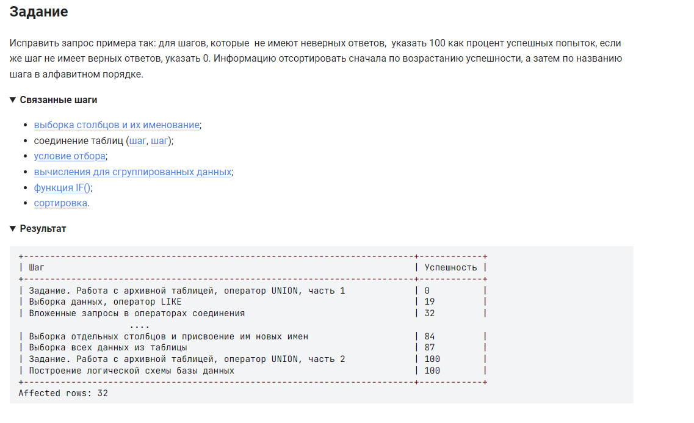

```sql
WITH get_count_correct (st_n_c, count_correct) 
  AS (
    SELECT step_name, count(*)
    FROM 
        step 
        INNER JOIN step_student USING (step_id)
    WHERE result = "correct"
    GROUP BY step_name
   ),
  get_count_wrong (st_n_w, count_wrong) 
  AS (
    SELECT step_name, count(*)
    FROM 
        step 
        INNER JOIN step_student USING (step_id)
    WHERE result = "wrong"
    GROUP BY step_name
   )  
SELECT st_n_c AS Шаг,
    IF((ROUND(count_correct / (count_correct + count_wrong) * 100)) IS NOT NULL, 
       (ROUND(count_correct / (count_correct + count_wrong) * 100)), 
       100) AS Успешность
FROM  
    get_count_correct 
    LEFT JOIN get_count_wrong ON st_n_c = st_n_w
UNION
SELECT st_n_w AS Шаг,
    IF((ROUND(count_correct / (count_correct + count_wrong) * 100)) IS NOT NULL, 
       (ROUND(count_correct / (count_correct + count_wrong) * 100)), 
       0) AS Успешность
FROM  
    get_count_correct 
    RIGHT JOIN get_count_wrong ON st_n_c = st_n_w
ORDER BY 2, 1 ;

```


#### На [главную](https://github.com/BEPb/stepik_sql#readme)

---


