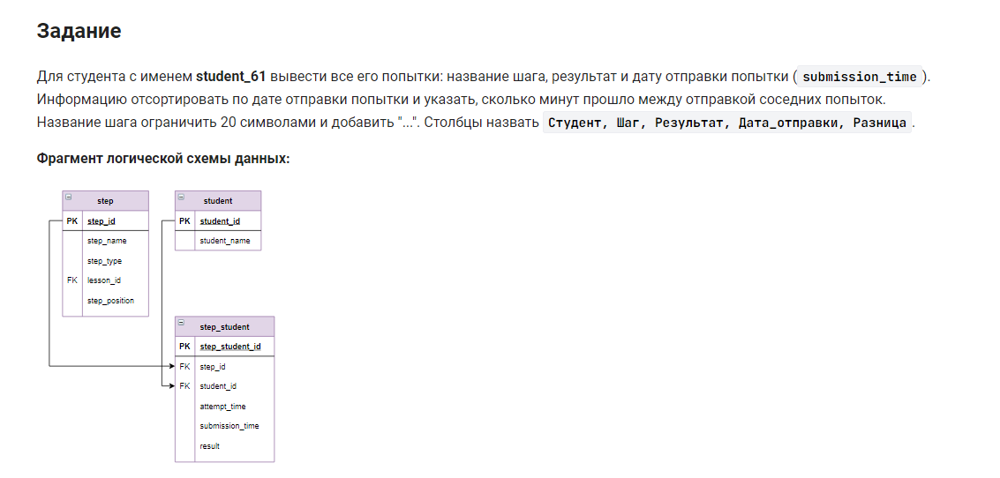

```sql
SELECT
    student_name Студент,
    CONCAT(LEFT(step_name, 20), '...') Шаг,
    result Результат,
    FROM_UNIXTIME(submission_time) Дата_отправки,
    SEC_TO_TIME(IFNULL(submission_time -
                       LAG(submission_time)
                           OVER (ORDER BY submission_time),
                       0)) AS Разница
FROM
    step_student
    JOIN student USING (student_id)
    JOIN step USING (step_id)
WHERE
    student_name = 'student_61'
```


#### На [главную](https://github.com/BEPb/stepik_sql#readme)

---


