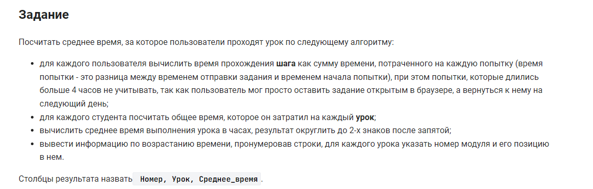

```sql
WITH temp2 AS (
    WITH temp1 AS (
        SELECT
            CONCAT(module_id, '.', lesson_position, ' ', lesson_name) Урок,
            SUM((submission_time - attempt_time) / 3600) Время
        FROM
            module
            INNER JOIN lesson USING (module_id)
            INNER JOIN step USING (lesson_id)
            INNER JOIN step_student USING (step_id)
        WHERE
            submission_time - attempt_time <= 4 * 60 * 60
        GROUP BY
            student_id,
            Урок
    )
    SELECT
        Урок,
        ROUND(AVG(Время), 2) Среднее_время
    FROM
        temp1
    GROUP BY
        Урок
)
SELECT
    ROW_NUMBER() OVER(ORDER BY Среднее_время) Номер,
    Урок,
    Среднее_время
FROM
    temp2
```


#### На [главную](https://github.com/BEPb/stepik_sql#readme)

---


