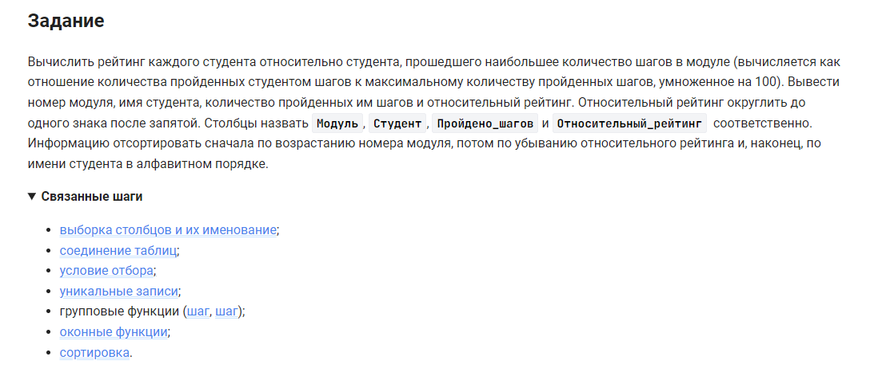

```sql
WITH temp AS (
SELECT
    module_id Модуль,
    student_name Студент,
    count(DISTINCT step_id) Пройдено_шагов
FROM
    student
    INNER JOIN step_student USING(student_id)
    INNER JOIN step USING (step_id)
    INNER JOIN lesson USING (lesson_id)
WHERE
    result = "correct"
GROUP BY
    module_id,
    student_name
)

SELECT
    Модуль,
    Студент,
    Пройдено_шагов,
    ROUND(100 * Пройдено_шагов / MAX(Пройдено_шагов) OVER (PARTITION BY Модуль), 1) Относительный_рейтинг
FROM
    temp
ORDER BY
    Модуль,
    Относительный_рейтинг DESC,
    Студент
```


#### На [главную](https://github.com/BEPb/stepik_sql#readme)

---


