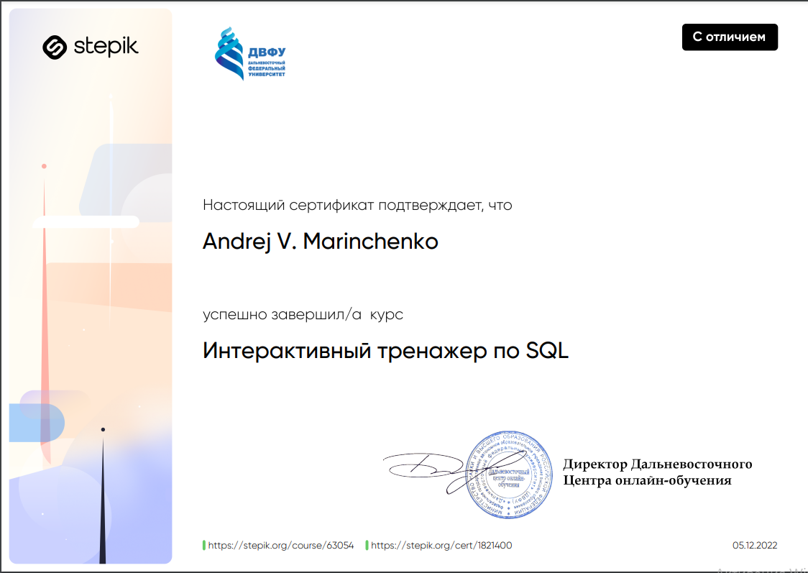

<div align="center">


# Интерактивный тренажер по SQL

</div>

## Как это работает?

Все очень просто: переходи по [ссылке](https://stepik.org/course/63054/syllabus) курса и учись, а если уже все идеи при решении практических задач закончились, обращайся к моим подсказкам.

## Порядок подготовки и работы с ботом

1. Клонировать репозиторий либо скачать архив из github или при помощи следующих команд в командной строке
   ```commandline
   $ cmd
   $ git clone https://github.com/BEPb/stepik_python
   $ cd stepik_sql
   ```

2. Приступить к обучению, по следующей программе:
## Содержание
  
* **1. Основы реляционной модели SQL**
#### В данном модуле рассматриваются основные понятия реляционной модели, а также различные виды SQL запросов к одной таблице базы данных  
 1.1   Отношение (таблица):
   - 1.1.1. [теоретический вопрос](https://github.com/BEPb/stepik_sql/blob/master/1.%20%D0%9E%D1%81%D0%BD%D0%BE%D0%B2%D1%8B%20%D1%80%D0%B5%D0%BB%D1%8F%D1%86%D0%B8%D0%BE%D0%BD%D0%BD%D0%BE%D0%B9%20%D0%BC%D0%BE%D0%B4%D0%B5%D0%BB%D0%B8%20%D0%B8%20SQL/1.1%20%D0%9E%D1%82%D0%BD%D0%BE%D1%88%D0%B5%D0%BD%D0%B8%D0%B5%20(%D1%82%D0%B0%D0%B1%D0%BB%D0%B8%D1%86%D0%B0)/1.1.1.%20%D1%82%D0%B5%D0%BE%D1%80%D0%B5%D1%82%D0%B8%D1%87%D0%B5%D1%81%D0%BA%D0%B8%D0%B9%20%D0%B2%D0%BE%D0%BF%D1%80%D0%BE%D1%81.md)
   - 1.1.2. [теоретический вопрос](https://github.com/BEPb/stepik_sql/blob/master/1.%20%D0%9E%D1%81%D0%BD%D0%BE%D0%B2%D1%8B%20%D1%80%D0%B5%D0%BB%D1%8F%D1%86%D0%B8%D0%BE%D0%BD%D0%BD%D0%BE%D0%B9%20%D0%BC%D0%BE%D0%B4%D0%B5%D0%BB%D0%B8%20%D0%B8%20SQL/1.1%20%D0%9E%D1%82%D0%BD%D0%BE%D1%88%D0%B5%D0%BD%D0%B8%D0%B5%20(%D1%82%D0%B0%D0%B1%D0%BB%D0%B8%D1%86%D0%B0)/1.1.2.%20%D1%82%D0%B5%D0%BE%D1%80%D0%B5%D1%82%D0%B8%D1%87%D0%B5%D1%81%D0%BA%D0%B8%D0%B9%20%D0%B2%D0%BE%D0%BF%D1%80%D0%BE%D1%81.md)
   - 1.1.3. [теоретический вопрос](https://github.com/BEPb/stepik_sql/blob/master/1.%20%D0%9E%D1%81%D0%BD%D0%BE%D0%B2%D1%8B%20%D1%80%D0%B5%D0%BB%D1%8F%D1%86%D0%B8%D0%BE%D0%BD%D0%BD%D0%BE%D0%B9%20%D0%BC%D0%BE%D0%B4%D0%B5%D0%BB%D0%B8%20%D0%B8%20SQL/1.1%20%D0%9E%D1%82%D0%BD%D0%BE%D1%88%D0%B5%D0%BD%D0%B8%D0%B5%20(%D1%82%D0%B0%D0%B1%D0%BB%D0%B8%D1%86%D0%B0)/1.1.3.%20%D1%82%D0%B5%D0%BE%D1%80%D0%B5%D1%82%D0%B8%D1%87%D0%B5%D1%81%D0%BA%D0%B8%D0%B9%20%D0%B2%D0%BE%D0%BF%D1%80%D0%BE%D1%81.md)
   - 1.1.4. [практический вопрос](https://github.com/BEPb/stepik_sql/blob/master/1.%20%D0%9E%D1%81%D0%BD%D0%BE%D0%B2%D1%8B%20%D1%80%D0%B5%D0%BB%D1%8F%D1%86%D0%B8%D0%BE%D0%BD%D0%BD%D0%BE%D0%B9%20%D0%BC%D0%BE%D0%B4%D0%B5%D0%BB%D0%B8%20%D0%B8%20SQL/1.1%20%D0%9E%D1%82%D0%BD%D0%BE%D1%88%D0%B5%D0%BD%D0%B8%D0%B5%20(%D1%82%D0%B0%D0%B1%D0%BB%D0%B8%D1%86%D0%B0)/1.1.4.%20%D0%BF%D1%80%D0%B0%D0%BA%D1%82%D0%B8%D1%87%D0%B5%D1%81%D0%BA%D0%B8%D0%B9%20%D0%B2%D0%BE%D0%BF%D1%80%D0%BE%D1%81.md)
   - 1.1.5. [практический вопрос](https://github.com/BEPb/stepik_sql/blob/master/1.%20%D0%9E%D1%81%D0%BD%D0%BE%D0%B2%D1%8B%20%D1%80%D0%B5%D0%BB%D1%8F%D1%86%D0%B8%D0%BE%D0%BD%D0%BD%D0%BE%D0%B9%20%D0%BC%D0%BE%D0%B4%D0%B5%D0%BB%D0%B8%20%D0%B8%20SQL/1.1%20%D0%9E%D1%82%D0%BD%D0%BE%D1%88%D0%B5%D0%BD%D0%B8%D0%B5%20(%D1%82%D0%B0%D0%B1%D0%BB%D0%B8%D1%86%D0%B0)/1.1.5.%20%D0%BF%D1%80%D0%B0%D0%BA%D1%82%D0%B8%D1%87%D0%B5%D1%81%D0%BA%D0%B8%D0%B9%20%D0%B2%D0%BE%D0%BF%D1%80%D0%BE%D1%81.md)
   - 1.1.6. [практический вопрос](https://github.com/BEPb/stepik_sql/blob/master/1.%20%D0%9E%D1%81%D0%BD%D0%BE%D0%B2%D1%8B%20%D1%80%D0%B5%D0%BB%D1%8F%D1%86%D0%B8%D0%BE%D0%BD%D0%BD%D0%BE%D0%B9%20%D0%BC%D0%BE%D0%B4%D0%B5%D0%BB%D0%B8%20%D0%B8%20SQL/1.1%20%D0%9E%D1%82%D0%BD%D0%BE%D1%88%D0%B5%D0%BD%D0%B8%D0%B5%20(%D1%82%D0%B0%D0%B1%D0%BB%D0%B8%D1%86%D0%B0)/1.1.6.%20%D0%BF%D1%80%D0%B0%D0%BA%D1%82%D0%B8%D1%87%D0%B5%D1%81%D0%BA%D0%B8%D0%B9%20%D0%B2%D0%BE%D0%BF%D1%80%D0%BE%D1%81.md)

 1.2   Выборка данных  
   - 1.2.1. [практический вопрос](https://github.com/BEPb/stepik_sql/blob/master/1.%20%D0%9E%D1%81%D0%BD%D0%BE%D0%B2%D1%8B%20%D1%80%D0%B5%D0%BB%D1%8F%D1%86%D0%B8%D0%BE%D0%BD%D0%BD%D0%BE%D0%B9%20%D0%BC%D0%BE%D0%B4%D0%B5%D0%BB%D0%B8%20%D0%B8%20SQL/1.2%20%D0%92%D1%8B%D0%B1%D0%BE%D1%80%D0%BA%D0%B0%20%D0%B4%D0%B0%D0%BD%D0%BD%D1%8B%D1%85/1.2.1.%20%D0%BF%D1%80%D0%B0%D0%BA%D1%82%D0%B8%D1%87%D0%B5%D1%81%D0%BA%D0%B8%D0%B9%20%D0%B2%D0%BE%D0%BF%D1%80%D0%BE%D1%81.md)
   - 1.2.2. [практический вопрос](https://github.com/BEPb/stepik_sql/blob/master/1.%20%D0%9E%D1%81%D0%BD%D0%BE%D0%B2%D1%8B%20%D1%80%D0%B5%D0%BB%D1%8F%D1%86%D0%B8%D0%BE%D0%BD%D0%BD%D0%BE%D0%B9%20%D0%BC%D0%BE%D0%B4%D0%B5%D0%BB%D0%B8%20%D0%B8%20SQL/1.2%20%D0%92%D1%8B%D0%B1%D0%BE%D1%80%D0%BA%D0%B0%20%D0%B4%D0%B0%D0%BD%D0%BD%D1%8B%D1%85/1.2.2.%20%D0%BF%D1%80%D0%B0%D0%BA%D1%82%D0%B8%D1%87%D0%B5%D1%81%D0%BA%D0%B8%D0%B9%20%D0%B2%D0%BE%D0%BF%D1%80%D0%BE%D1%81.md)
   - 1.2.3. [практический вопрос](https://github.com/BEPb/stepik_sql/blob/master/1.%20%D0%9E%D1%81%D0%BD%D0%BE%D0%B2%D1%8B%20%D1%80%D0%B5%D0%BB%D1%8F%D1%86%D0%B8%D0%BE%D0%BD%D0%BD%D0%BE%D0%B9%20%D0%BC%D0%BE%D0%B4%D0%B5%D0%BB%D0%B8%20%D0%B8%20SQL/1.2%20%D0%92%D1%8B%D0%B1%D0%BE%D1%80%D0%BA%D0%B0%20%D0%B4%D0%B0%D0%BD%D0%BD%D1%8B%D1%85/1.2.3.%20%D0%BF%D1%80%D0%B0%D0%BA%D1%82%D0%B8%D1%87%D0%B5%D1%81%D0%BA%D0%B8%D0%B9%20%D0%B2%D0%BE%D0%BF%D1%80%D0%BE%D1%81.md)
   - 1.2.4. [практический вопрос](https://github.com/BEPb/stepik_sql/blob/master/1.%20%D0%9E%D1%81%D0%BD%D0%BE%D0%B2%D1%8B%20%D1%80%D0%B5%D0%BB%D1%8F%D1%86%D0%B8%D0%BE%D0%BD%D0%BD%D0%BE%D0%B9%20%D0%BC%D0%BE%D0%B4%D0%B5%D0%BB%D0%B8%20%D0%B8%20SQL/1.2%20%D0%92%D1%8B%D0%B1%D0%BE%D1%80%D0%BA%D0%B0%20%D0%B4%D0%B0%D0%BD%D0%BD%D1%8B%D1%85/1.2.4.%20%D0%BF%D1%80%D0%B0%D0%BA%D1%82%D0%B8%D1%87%D0%B5%D1%81%D0%BA%D0%B8%D0%B9%20%D0%B2%D0%BE%D0%BF%D1%80%D0%BE%D1%81.md)
   - 1.2.5. [практический вопрос](https://github.com/BEPb/stepik_sql/blob/master/1.%20%D0%9E%D1%81%D0%BD%D0%BE%D0%B2%D1%8B%20%D1%80%D0%B5%D0%BB%D1%8F%D1%86%D0%B8%D0%BE%D0%BD%D0%BD%D0%BE%D0%B9%20%D0%BC%D0%BE%D0%B4%D0%B5%D0%BB%D0%B8%20%D0%B8%20SQL/1.2%20%D0%92%D1%8B%D0%B1%D0%BE%D1%80%D0%BA%D0%B0%20%D0%B4%D0%B0%D0%BD%D0%BD%D1%8B%D1%85/1.2.5.%20%D0%BF%D1%80%D0%B0%D0%BA%D1%82%D0%B8%D1%87%D0%B5%D1%81%D0%BA%D0%B8%D0%B9%20%D0%B2%D0%BE%D0%BF%D1%80%D0%BE%D1%81.md)
   - 1.2.6. [практический вопрос](https://github.com/BEPb/stepik_sql/blob/master/1.%20%D0%9E%D1%81%D0%BD%D0%BE%D0%B2%D1%8B%20%D1%80%D0%B5%D0%BB%D1%8F%D1%86%D0%B8%D0%BE%D0%BD%D0%BD%D0%BE%D0%B9%20%D0%BC%D0%BE%D0%B4%D0%B5%D0%BB%D0%B8%20%D0%B8%20SQL/1.2%20%D0%92%D1%8B%D0%B1%D0%BE%D1%80%D0%BA%D0%B0%20%D0%B4%D0%B0%D0%BD%D0%BD%D1%8B%D1%85/1.2.6.%20%D0%BF%D1%80%D0%B0%D0%BA%D1%82%D0%B8%D1%87%D0%B5%D1%81%D0%BA%D0%B8%D0%B9%20%D0%B2%D0%BE%D0%BF%D1%80%D0%BE%D1%81.md)
   - 1.2.7. [практический вопрос](https://github.com/BEPb/stepik_sql/blob/master/1.%20%D0%9E%D1%81%D0%BD%D0%BE%D0%B2%D1%8B%20%D1%80%D0%B5%D0%BB%D1%8F%D1%86%D0%B8%D0%BE%D0%BD%D0%BD%D0%BE%D0%B9%20%D0%BC%D0%BE%D0%B4%D0%B5%D0%BB%D0%B8%20%D0%B8%20SQL/1.2%20%D0%92%D1%8B%D0%B1%D0%BE%D1%80%D0%BA%D0%B0%20%D0%B4%D0%B0%D0%BD%D0%BD%D1%8B%D1%85/1.2.7.%20%D0%BF%D1%80%D0%B0%D0%BA%D1%82%D0%B8%D1%87%D0%B5%D1%81%D0%BA%D0%B8%D0%B9%20%D0%B2%D0%BE%D0%BF%D1%80%D0%BE%D1%81.md)
   - 1.2.8. [практический вопрос](https://github.com/BEPb/stepik_sql/blob/master/1.%20%D0%9E%D1%81%D0%BD%D0%BE%D0%B2%D1%8B%20%D1%80%D0%B5%D0%BB%D1%8F%D1%86%D0%B8%D0%BE%D0%BD%D0%BD%D0%BE%D0%B9%20%D0%BC%D0%BE%D0%B4%D0%B5%D0%BB%D0%B8%20%D0%B8%20SQL/1.2%20%D0%92%D1%8B%D0%B1%D0%BE%D1%80%D0%BA%D0%B0%20%D0%B4%D0%B0%D0%BD%D0%BD%D1%8B%D1%85/1.2.8.%20%D0%BF%D1%80%D0%B0%D0%BA%D1%82%D0%B8%D1%87%D0%B5%D1%81%D0%BA%D0%B8%D0%B9%20%D0%B2%D0%BE%D0%BF%D1%80%D0%BE%D1%81.md)
   - 1.2.9. [практический вопрос](https://github.com/BEPb/stepik_sql/blob/master/1.%20%D0%9E%D1%81%D0%BD%D0%BE%D0%B2%D1%8B%20%D1%80%D0%B5%D0%BB%D1%8F%D1%86%D0%B8%D0%BE%D0%BD%D0%BD%D0%BE%D0%B9%20%D0%BC%D0%BE%D0%B4%D0%B5%D0%BB%D0%B8%20%D0%B8%20SQL/1.2%20%D0%92%D1%8B%D0%B1%D0%BE%D1%80%D0%BA%D0%B0%20%D0%B4%D0%B0%D0%BD%D0%BD%D1%8B%D1%85/1.2.9.%20%D0%BF%D1%80%D0%B0%D0%BA%D1%82%D0%B8%D1%87%D0%B5%D1%81%D0%BA%D0%B8%D0%B9%20%D0%B2%D0%BE%D0%BF%D1%80%D0%BE%D1%81.md)
   - 1.2.10. [практический вопрос](https://github.com/BEPb/stepik_sql/blob/master/1.%20%D0%9E%D1%81%D0%BD%D0%BE%D0%B2%D1%8B%20%D1%80%D0%B5%D0%BB%D1%8F%D1%86%D0%B8%D0%BE%D0%BD%D0%BD%D0%BE%D0%B9%20%D0%BC%D0%BE%D0%B4%D0%B5%D0%BB%D0%B8%20%D0%B8%20SQL/1.2%20%D0%92%D1%8B%D0%B1%D0%BE%D1%80%D0%BA%D0%B0%20%D0%B4%D0%B0%D0%BD%D0%BD%D1%8B%D1%85/1.2.10.%20%D0%BF%D1%80%D0%B0%D0%BA%D1%82%D0%B8%D1%87%D0%B5%D1%81%D0%BA%D0%B8%D0%B9%20%D0%B2%D0%BE%D0%BF%D1%80%D0%BE%D1%81.md)
   - 1.2.11. [практический вопрос](https://github.com/BEPb/stepik_sql/blob/master/1.%20%D0%9E%D1%81%D0%BD%D0%BE%D0%B2%D1%8B%20%D1%80%D0%B5%D0%BB%D1%8F%D1%86%D0%B8%D0%BE%D0%BD%D0%BD%D0%BE%D0%B9%20%D0%BC%D0%BE%D0%B4%D0%B5%D0%BB%D0%B8%20%D0%B8%20SQL/1.2%20%D0%92%D1%8B%D0%B1%D0%BE%D1%80%D0%BA%D0%B0%20%D0%B4%D0%B0%D0%BD%D0%BD%D1%8B%D1%85/1.2.11.%20%D0%BF%D1%80%D0%B0%D0%BA%D1%82%D0%B8%D1%87%D0%B5%D1%81%D0%BA%D0%B8%D0%B9%20%D0%B2%D0%BE%D0%BF%D1%80%D0%BE%D1%81.md)
   - 1.2.12. [практический вопрос](https://github.com/BEPb/stepik_sql/blob/master/1.%20%D0%9E%D1%81%D0%BD%D0%BE%D0%B2%D1%8B%20%D1%80%D0%B5%D0%BB%D1%8F%D1%86%D0%B8%D0%BE%D0%BD%D0%BD%D0%BE%D0%B9%20%D0%BC%D0%BE%D0%B4%D0%B5%D0%BB%D0%B8%20%D0%B8%20SQL/1.2%20%D0%92%D1%8B%D0%B1%D0%BE%D1%80%D0%BA%D0%B0%20%D0%B4%D0%B0%D0%BD%D0%BD%D1%8B%D1%85/1.2.12.%20%D0%BF%D1%80%D0%B0%D0%BA%D1%82%D0%B8%D1%87%D0%B5%D1%81%D0%BA%D0%B8%D0%B9%20%D0%B2%D0%BE%D0%BF%D1%80%D0%BE%D1%81.md)

 1.3   Запросы, групповый операции  
 1.4   Вложенные запросы  
 1.5   Запросы корректировки данных  
 1.6   Таблица "Командировки" - запросы на выборку  
 1.7   Таблица "Нарушители ПДД" - запросы корректировки
  
---

* **2. Запросы SQL к связанным таблицам**
#### В модуле рассматриваются связи между таблицами реляционной базы данных, а также различные виды запросов, построенных на связанных таблицах  
    2.1   Связи между таблицами  
    2.2   Запросы на выборку, соединение таблиц  
    2.3   Запросы корректировки, соединение таблиц  
    2.4   База данных «Интернет-магазин книг», запросы на выборку  
    2.5   База данных «Интернет-магазин книг», запросы корректировки
  
---

* **3. Базы данных и SQL запросы**
#### В модуле рассматривается несколько предметных областей, для каждой строится логическая модель базы данных. К каждой предметной области формулируются задания, которые можно выполнить запросами SQL
    3.1   База данных «Тестирование», запросы на выборку  
    3.2   База данных «Тестирование», запросы корректировки  
    3.3   База данных «Абитуриент», запросы на выборку  
    3.4   База данных «Абитуриент», запросы корректировки  
    3.5   База данных "Учебная аналитика по курсу"
  
---


Цель этого репозитория, помочь начинающему программисту получить знания, ну и как награду сертификат


